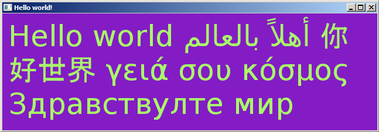

# SDL_Pango

This project is a lightweight rewrite of
[SDL_Pango](http://sdlpango.sourceforge.net/) to work with SDL2. The
code is much shorter and provides almost similar functionality.

# Documentation

See the implemented APIs in the header file `SDL_Pango.h` and their
[documentation](http://sdlpango.sourceforge.net/_s_d_l___pango_8c.html) on the
original SDL_Pango project.

# Different API from SDL_Pango

Only the following functions are implemented:

    SDLPango_Init
    SDLPango_WasInit
    SDLPango_CreateContext
    SDLPango_FreeContext
    SDLPango_SetMinimumSize
    SDLPango_GetLayoutHeight
    SDLPango_GetLayoutWidth
    SDLPango_SetMarkup
    SDLPango_Draw

The function [`SDLPango_SetDefaultColor`](http://sdlpango.sourceforge.net/_s_d_l___pango_8c.html#a29) is replaced by:

    void
    SDLPango_SetColor(SDLPango_Context* context,
                      const SDL_Color* color);

    SDL_Color
    SDLPango_GetColor(SDLPango_Context* context);

# Build

    $ gcc -Wall -Wextra -pedantic -std=c99 $(pkg-config --cflags pango sdl2 freetype2 pangoft2) SDL_Pango.c example.c $(pkg-config --libs pango sdl2 freetype2 pangoft2) -o example
    $ ./example
